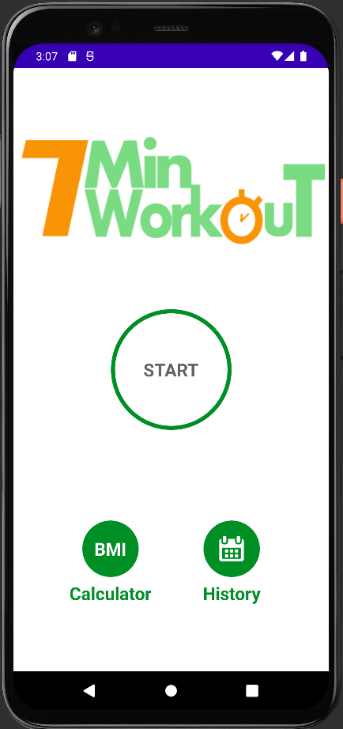
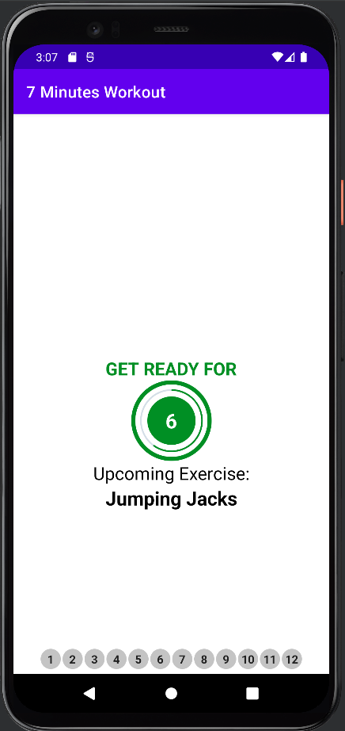
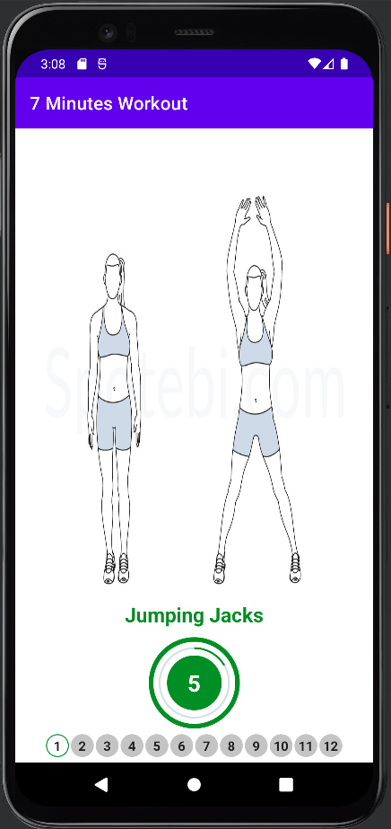
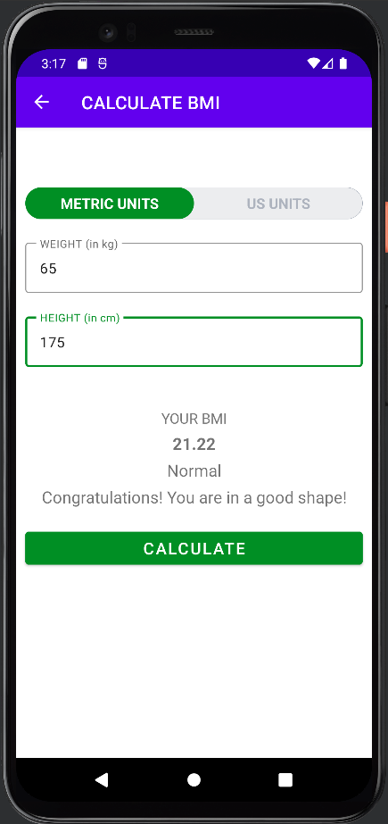
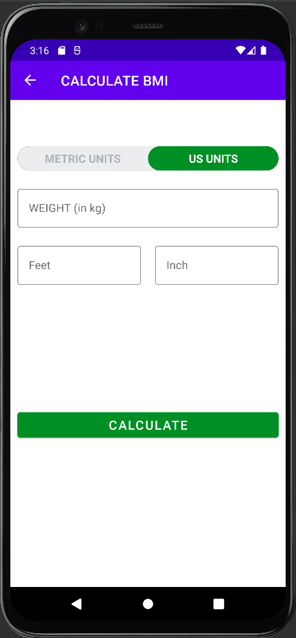
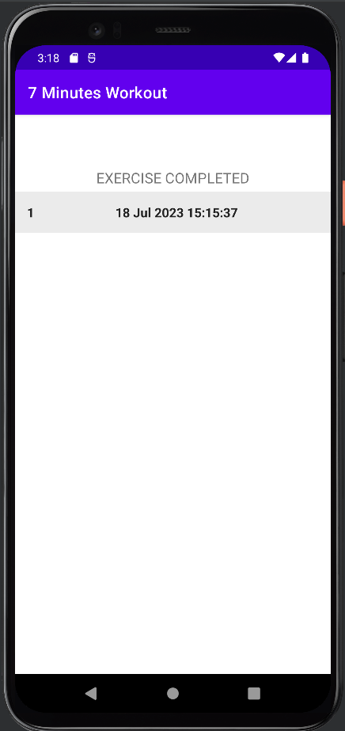

# Workout App

This is a workout app developed in Android Studio using Kotlin with Android 12. The app allows users to start a 7-minute workout session, calculate their BMI, and view their exercise history. It incorporates a timer for rest time and exercise duration, displays exercise images, and stores exercise completion times in a Room database.

## Features

- Start Button: Initiates a 7-minute workout session.
- BMI Calculator Button: Opens the BMI calculator to calculate body mass index.
- History Button: Displays the exercise history.
- Timer: Provides a countdown timer for rest time and exercise duration.
- Exercise Images: Shows exercise images during the workout session.
- Finish Screen: Displays a screen after completing the workout.
- BMI Calculator (Metric and US Units): Calculates body mass index based on user input.
- Room Database: Stores exercise completion times for viewing in the history.

## Screenshots

1. Activity Main:  
   

2. Workout Start Activity:  
   

3. Exercise Image:  
   

4. Finish Screen:  
   

5. BMI Calculator (Metric Units):  
   

6. BMI Calculator (US Units):  
   

7. History Activity:  
   

## Dependencies

The following dependencies are used in this project:

- Room: Used for database management.
- Glide: Used for loading and displaying images.
- Timer: Used for implementing the countdown timer.

You can find the specific versions of these dependencies in the `build.gradle` file.

## Usage

1. Launch the app on your Android device or emulator.
2. On the main screen, click the "Start" button to begin the 7-minute workout.
3. Rest time will start with a countdown timer, followed by each exercise displayed for 30 seconds with its corresponding image.
4. After completing the workout, the finish screen will appear.
5. To calculate your BMI, click the "BMI Calc" button. Enter your measurements in metric or US units and view the calculated BMI.
6. To view your exercise history, click the "History" button. The exercise completion times will be displayed.

